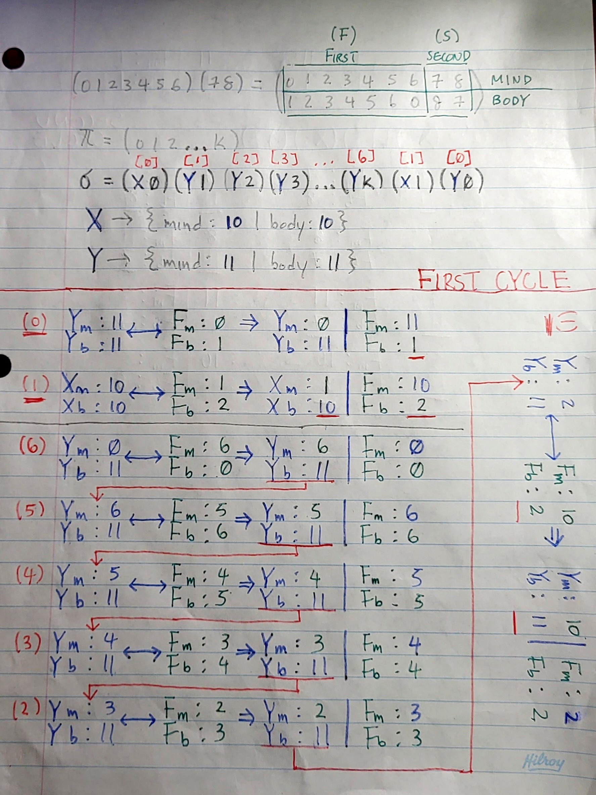
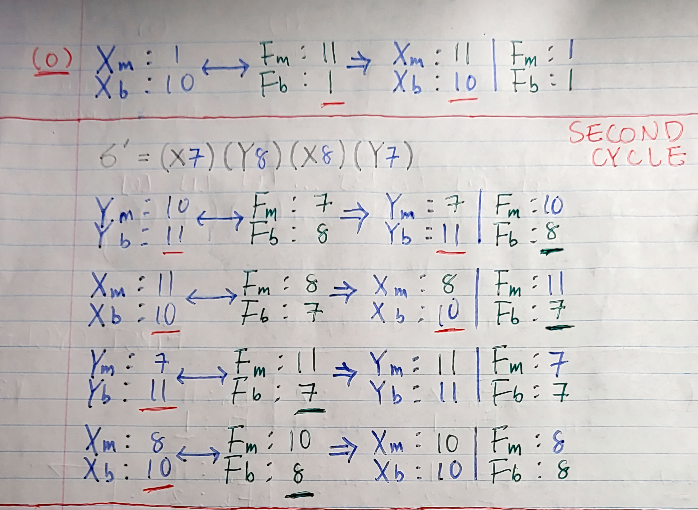

## Futurama Theorem C

First iteration of an experimental branch. Meaning code structing is not the main focus. Any feature implemented here may be brought over to more refactored code branches and restructured accordingly. 

## Info
- Added header files in [./include](/include) directory.
- Implementation files of header files in [./src](./src).
- Introduced [awkmenu.c](./src/awkmenu.c) and [awkmenu.h](./include/awkmenu.h) to learn about the [AWK tool](https://en.wikipedia.org/wiki/AWK):
    - Reads number of lines/words/characters in a txt file.
- Modified [Makefile](./Makefile) to properly link/compile/debug code files.

## Resources
* [Article](https://medium.com/@mikaeldavidsson/the-futurama-theorem-103980db677b)
* [Wiki](https://theinfosphere.org/Futurama_theorem)
* [Video](https://www.youtube.com/watch?v=ILmrtHlP9xY)

## Notes

