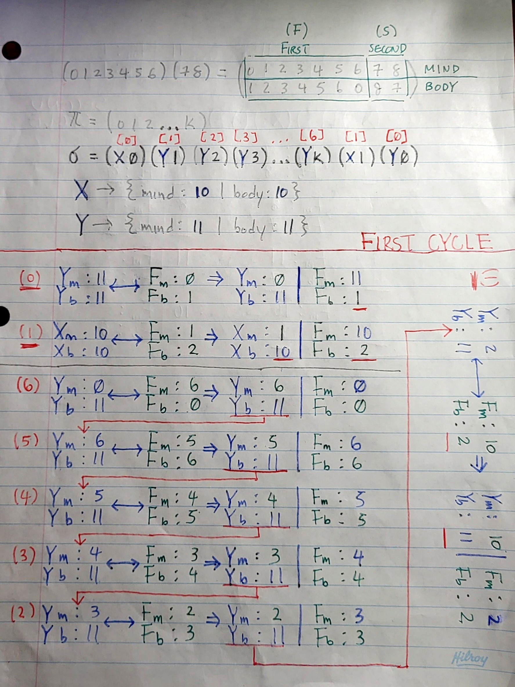
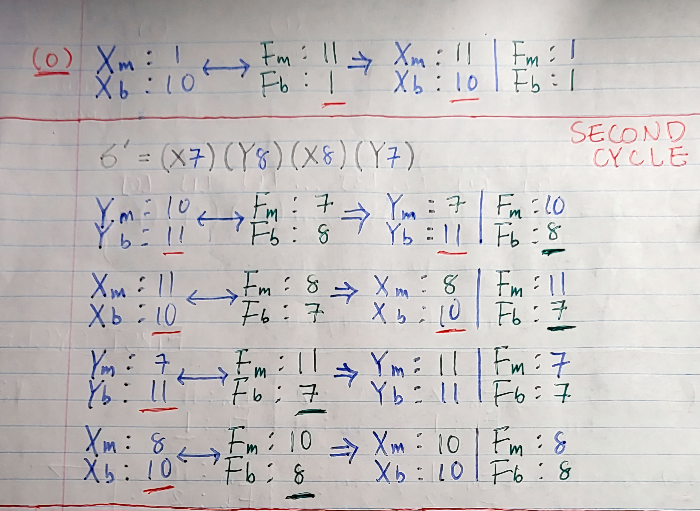

## Futurama Theorem C

Second iteration, this includes **unit testing**. Branched out in case you want to refer back to the original source.

## Info
* Introduced [Unity Test](https://github.com/ThrowTheSwitch/Unity/tree/master)
* Added ```mindswap.h``` file for unit testing purposes
* Added ```<stdbool.h>``` to modify return type of **initialize(...)** in [mindswap.h](./mindswap.h)
* Added ```<ctype.h>``` for user input handling for **initialize(...)** in [main.c](./main.c)
* Modified:
    - ```void initialize(void) ---> bool initialize(int num_people) ```
        - To better accomodate the unit testing
        - Added error message based on input
    
    - Directory structure
        - [unity_test directory](./unity_test/)
        - Notes in [resources directory](./resources/)
    
    - Makefile
        - [Link to Unity files](./Makefile)

## Resources
* [Article](https://medium.com/@mikaeldavidsson/the-futurama-theorem-103980db677b)
* [Wiki](https://theinfosphere.org/Futurama_theorem)
* [Video](https://www.youtube.com/watch?v=ILmrtHlP9xY)

## Notes




